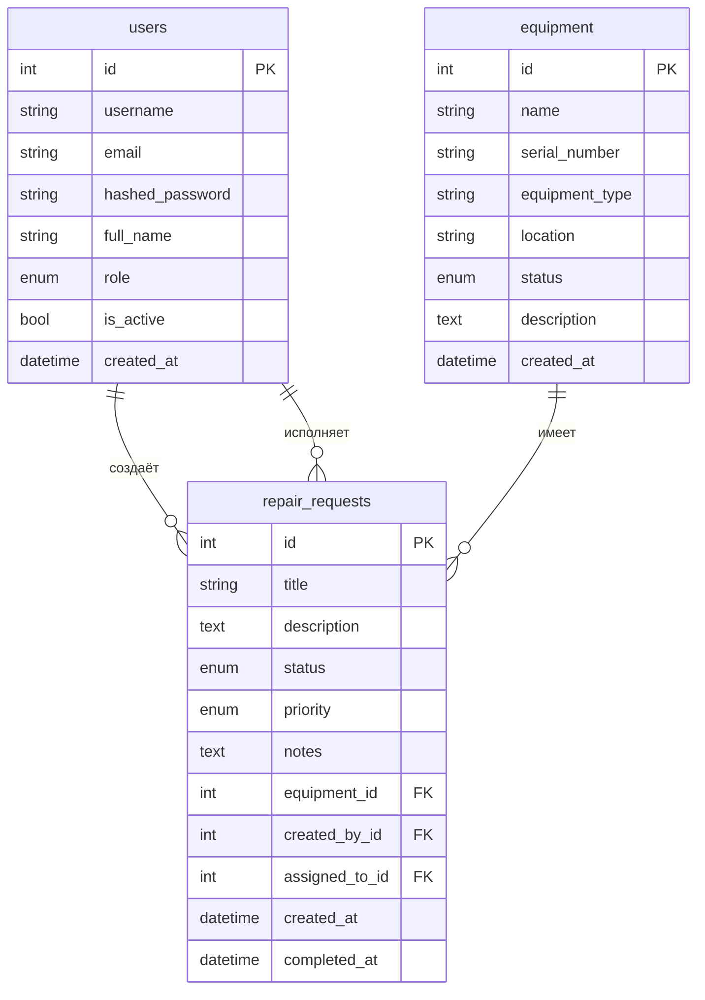
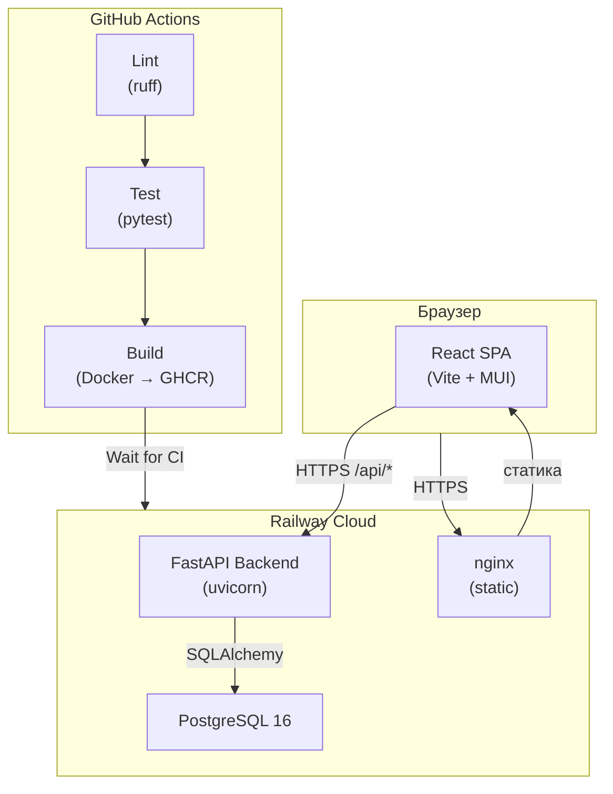

# FixFlow — Система обработки заявок на ремонт оборудования

Клиент-серверное приложение на основе методологии **12-факторного приложения**.

## Стек

| Слой | Технологии |
|------|-----------|
| Backend | Python 3.12, FastAPI, SQLAlchemy 2.0, Alembic |
| Database | PostgreSQL 16 (SQLite для local dev) |
| Frontend | TypeScript, React 18, Vite, MUI |
| Infra | Docker, Docker Compose, GitHub Actions |

## Архитектура (MVC)

```
backend/app/
├── models/       # M — SQLAlchemy-модели (User, Equipment, RepairRequest)
├── schemas/      # V — Pydantic-схемы (представление данных)
├── services/     # C — бизнес-логика
├── routers/      # HTTP-маршруты (View/Controller boundary)
├── config.py     # 12-factor: вся конфигурация из env vars
├── database.py   # Подключение к БД
├── logging_config.py  # Структурное JSON-логирование в stdout
├── middleware.py # Request-ID трассировка
└── main.py       # Точка входа, graceful shutdown
```

## ER-диаграмма базы данных



## Диаграмма компонентов



## Роли пользователей

| Роль | Права |
|------|-------|
| `admin` | Полный доступ, управление пользователями |
| `manager` | CRUD заявок и оборудования, назначение техников |
| `technician` | Просмотр всех заявок, обновление статуса/примечаний своих |
| `client` | Создание заявок, просмотр своих заявок |

## Тестовые данные (seed)

При первом запуске автоматически создаются:

| Логин | Пароль | Роль |
|-------|--------|------|
| `admin` | `admin123` | Администратор |
| `manager1` | `manager123` | Менеджер |
| `tech1` | `tech123` | Техник |
| `tech2` | `tech123` | Техник |
| `client1` | `client123` | Клиент |
| `client2` | `client123` | Клиент |

А также 5 единиц оборудования и 5 заявок с разными статусами.

## Быстрый старт (Docker)

```bash
cp .env.example .env
docker compose up --build
```

- Frontend: http://localhost:3000
- Backend API: http://localhost:8000
- Swagger UI: http://localhost:8000/docs

## Локальная разработка (без Docker)

```bash
cd backend
python -m venv .venv && source .venv/bin/activate
pip install -r requirements.txt
cp .env.example .env
uvicorn app.main:app --reload

cd frontend
npm install
npm run dev
```

## Переменные окружения

| Переменная | Описание | По умолчанию |
|------------|----------|--------------|
| `DATABASE_URL` | Строка подключения к БД | `sqlite:///./fixflow.db` |
| `SECRET_KEY` | JWT-секрет | `change-me...` |
| `PORT` | Порт backend | `8000` |
| `ENVIRONMENT` | `development` / `production` | `development` |
| `LOG_LEVEL` | Уровень логирования | `INFO` |

## Тесты

```bash
cd backend
pytest tests/ -v
```

Покрытие: auth, оборудование, заявки + **фаззинг-тестирование** (`tests/test_fuzz.py`).

## CI/CD (GitHub Actions)

При пуше в `main`:
1. **Lint** — проверка кода (ruff)
2. **Test** — запуск pytest
3. **Build** — сборка Docker-образов → GHCR
4. Railway автодеплоит после зелёного CI (Wait for CI)

## Структура проекта

```
FixFlow/
├── backend/
│   ├── app/
│   │   ├── models/
│   │   ├── schemas/
│   │   ├── services/
│   │   ├── routers/
│   │   └── main.py
│   ├── migrations/
│   ├── tests/
│   ├── Dockerfile
│   └── requirements.txt
├── frontend/
│   ├── src/
│   ├── Dockerfile
│   └── nginx.conf
├── .github/workflows/
├── docker-compose.yml
└── .env.example
```
